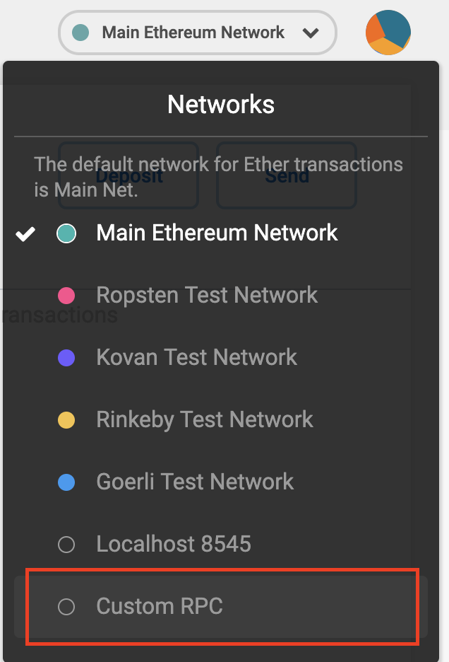
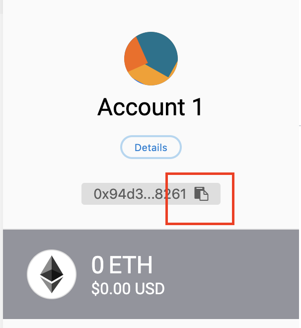

# 2019-genesis-workshop

Welcome to the workshop!

If there are no instruction for your system (Mac/Ubuntu) then there is nothing to be done.

# Slack channel

1. Go to #coblox-workshop
2. The url of the repo in the topic, clone it: `git clone https://github.com/coblox/2019-genesis-workshop`

## Tooling

1. Install Brew:
   - Mac: `/usr/bin/ruby -e "$(curl -fsSL https://raw.githubusercontent.com/Homebrew/install/master/install)"`
2. Docker
   - Mac: https://download.docker.com/mac/beta/Docker.dmg or `brew cask install docker`
   - Ubuntu: https://docs.docker.com/install/linux/docker-ce/ubuntu/#install-using-the-repository
3. Build tools:
   - Ubuntu: `apt-get install build-essential`
4. Install `rustup`: `curl https://sh.rustup.rs -sSf | sh`
5. Install libzmq:
   - Ubuntu/Debian: `apt install libzmq3-dev`
   - Mac ([Homebrew](https://brew.sh/)) `brew install zeromq`
6. Install OpenSSL:
   - Ubuntu/Debian: `apt install libssl-dev pkg-config`
7. Source profile to add `cargo` to `$PATH`: `source ~/.profile`

## Comit
1. Clone comit-rs repo: `git clone https://github.com/comit-network/comit-rs.git && cd comit-rs`
2. Install:
   - `cargo install --path application/comit_node`
   - `cargo install --path application/btsieve`
3. Setup [Bitcoin](#Bitcoin) & [Ethereum](#Ethereum)
4. In `btsieve.toml` file, replace `REPLACE_THIS_ETHEREUM_NODE_URL` with Ethereum URL from Slack topic
5. Start btsieve: `btsieve --config ./btsieve.toml` 
6. Start comit_node: `comit_node`
7. Go to [http://localhost:8080]
8. Accept to register comit links with your browser

## Bitcoin
1. In `docker-compose.yml`, replace `BITCOIN_NODE_IP` with Bitcoin Node IP from Slack topic 
2. Start Bitcoin node from the workshop folder: `docker-compose up`

## Ethereum
1. Install metamask: https://metamask.io/
2. Setup Metamask by following the wizard (new wallet). Yes you have to do the seed phrase thing.
3. Connect metamask to our Ethereum node:
  - Choose "Custom RPC"
    
    
  - Network Name: "CoBloX Test"
  - New RPC URL: Ethereum URL from Slack topic
  - Leave the rest empty
4. Send your address in the chat "Fund me please"

  
  
# Do a Swap!

For Ethereum actions: use metamask

For Bitcoin actions: need to use commandline (do `docker ps` to find out the `DOCKER_ID`)
- `alias btc-cli='docker exec -it <DOCKER_ID> bitcoin-cli -regtest -rpcport=18443 -rpcuser=bitcoin -rpcpassword=54pLR_f7-G6is32LP-7nbhzZSbJs_2zSATtZV_r05yg='`
- Send money: `btc-cli sendtoaddress "address" amount`
- Broadcast transaction: `btc-cli sendrawtransaction <transaction hex>`

Start by buying Bitcoin with Ether from our bobtimus (click the link in the chat).
